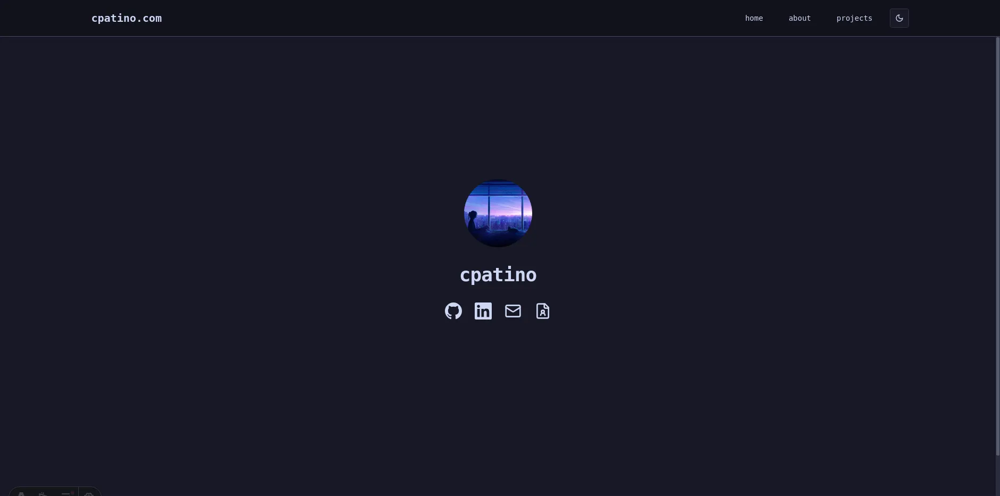

# cpatino.com

A personal portfolio site built with Astro, React, and TailwindCSS.  
Showcases projects, resume, and contact information for Carlos Patino.  
Optimized for performance, accessibility, best practices, and SEO (Lighthouse scores: 100/95/100/100).

## Screenshots



## Installation

1. Clone the repository:
   ```sh
   git clone https://github.com/c4patino/cpatino.com.git
   cd cpatino.com
   ```
2. Install dependencies:
   ```sh
   pnpm install
   ```

## Usage

- Start development server:
  ```sh
  pnpm dev
  ```
- Build for production:
  ```sh
  pnpm build
  ```
- Preview production build:
  ```sh
  pnpm preview
  ```

## License

[Apache License 2.0](https://www.apache.org/licenses/LICENSE-2.0)

## Authors

- [@c4patino](https://www.github.com/c4patino)
